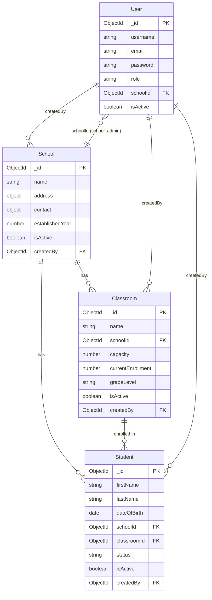

# School Management System API

A comprehensive RESTful API for managing schools, classrooms, and students with role-based access control (RBAC).

## Table of Contents

- [Features](#features)
- [Architecture](#architecture)
- [Prerequisites](#prerequisites)
- [Installation](#installation)
- [Configuration](#configuration)
- [API Documentation](#api-documentation)
- [Authentication](#authentication)
- [Role-Based Access Control](#role-based-access-control)
- [Database Schema](#database-schema)
- [Error Handling](#error-handling)
- [Rate Limiting](#rate-limiting)
- [Testing](#testing)
- [Deployment](#deployment)

## Features

- **RESTful API** using Express.js
- **JWT-based Authentication** with long and short tokens
- **Role-Based Access Control (RBAC)**:
  - Superadmin: Full system access
  - School Administrator: School-specific access
- **Complete CRUD Operations** for:
  - Schools
  - Classrooms
  - Students
- **Input Validation** using schema-based validation
- **Rate Limiting** to prevent abuse
- **MongoDB** for data persistence
- **Redis** for caching and rate limiting

## Architecture

The project follows a modular architecture pattern:

```
├── managers/
│   ├── entities/          # Entity managers (User, School, Classroom, Student)
│   ├── api/               # API handler
│   ├── http/              # HTTP server
│   ├── token/             # JWT token management
│   └── ...
├── mws/                   # Middlewares
├── loaders/               # Module loaders
├── config/                # Configuration
├── cache/                 # Redis cache client
└── connect/               # Database connections
```

## Prerequisites

- Node.js (v14 or higher)
- MongoDB (v4.4 or higher)
- Redis (v6 or higher)
- npm or yarn

## Installation

1. Clone the repository:
```bash
git clone <repository-url>
cd axion
```

2. Install dependencies:
```bash
npm install
```

3. Set up environment variables (see Configuration section)

4. Start MongoDB and Redis services

5. Run the application:
```bash
node index.js
```

The server will start on port 5111 (default) or the port specified in `USER_PORT` environment variable.

## Configuration

Create a `.env` file in the root directory with the following variables:

```env
# Service Configuration
SERVICE_NAME=axion
ENV=development
USER_PORT=5111

# MongoDB Configuration
MONGO_URI=mongodb://localhost:27017/axion

# Redis Configuration
REDIS_URI=redis://127.0.0.1:6379
CACHE_REDIS=redis://127.0.0.1:6379
CACHE_PREFIX=axion:ch
CORTEX_REDIS=redis://127.0.0.1:6379
CORTEX_PREFIX=none
OYSTER_REDIS=redis://127.0.0.1:6379
OYSTER_PREFIX=none

# JWT Secrets (IMPORTANT: Use strong, random secrets in production)
LONG_TOKEN_SECRET=your-long-token-secret-here
SHORT_TOKEN_SECRET=your-short-token-secret-here
NACL_SECRET=your-nacl-secret-here
```

## API Documentation

### Base URL
```
http://localhost:5111/api
```

### Endpoint Structure
All endpoints follow the pattern: `/api/:moduleName/:fnName`

### Authentication Endpoints

#### Register User
```http
POST /api/user/register
Content-Type: application/json

{
  "username": "john_doe",
  "email": "john@example.com",
  "password": "securepassword123",
  "role": "school_admin"
}
```

**Response:**
```json
{
  "ok": true,
  "data": {
    "user": {
      "id": "...",
      "username": "john_doe",
      "email": "john@example.com",
      "role": "school_admin"
    },
    "longToken": "eyJhbGciOiJIUzI1NiIsInR5cCI6IkpXVCJ9..."
  }
}
```

#### Login
```http
POST /api/user/login
Content-Type: application/json

{
  "email": "john@example.com",
  "password": "securepassword123"
}
```

**Response:**
```json
{
  "ok": true,
  "data": {
    "user": {
      "id": "...",
      "username": "john_doe",
      "email": "john@example.com",
      "role": "school_admin",
      "schoolId": "..."
    },
    "longToken": "...",
    "shortToken": "..."
  }
}
```

#### Get Profile
```http
GET /api/user/getProfile
Headers: { "token": "your-short-token" }
```

#### Update Profile
```http
PUT /api/user/updateProfile
Headers: { "token": "your-short-token" }
Content-Type: application/json

{
  "username": "new_username",
  "email": "newemail@example.com"
}
```

#### Assign School to User (Superadmin only)
```http
PUT /api/user/assignSchool
Headers: { "token": "superadmin-token" }
Content-Type: application/json

{
  "userId": "user-id",
  "schoolId": "school-id"
}
```

### School Endpoints

#### Create School (Superadmin only)
```http
POST /api/school/createSchool
Headers: { "token": "superadmin-token" }
Content-Type: application/json

{
  "name": "Lincoln High School",
  "address": {
    "street": "123 Main St",
    "city": "Springfield",
    "state": "IL",
    "zipCode": "62701",
    "country": "USA"
  },
  "contact": {
    "phone": "+1-555-0123",
    "email": "info@lincolnhigh.edu"
  },
  "establishedYear": 1950
}
```

#### Get School
```http
GET /api/school/getSchool?schoolId=school-id
Headers: { "token": "your-token" }
```

#### Get All Schools
```http
GET /api/school/getAllSchools?page=1&limit=10
Headers: { "token": "your-token" }
```

#### Update School (Superadmin only)
```http
PUT /api/school/updateSchool
Headers: { "token": "superadmin-token" }
Content-Type: application/json

{
  "schoolId": "school-id",
  "name": "Updated School Name",
  "isActive": true
}
```

#### Delete School (Superadmin only)
```http
DELETE /api/school/deleteSchool
Headers: { "token": "superadmin-token" }
Content-Type: application/json

{
  "schoolId": "school-id"
}
```

### Classroom Endpoints

#### Create Classroom (School Admin only)
```http
POST /api/classroom/createClassroom
Headers: { "token": "school-admin-token" }
Content-Type: application/json

{
  "name": "Grade 10-A",
  "schoolId": "school-id",
  "capacity": 30,
  "gradeLevel": "10",
  "resources": {
    "projector": "available",
    "computers": "20"
  }
}
```

#### Get Classroom
```http
GET /api/classroom/getClassroom?classroomId=classroom-id
Headers: { "token": "your-token" }
```

#### Get All Classrooms
```http
GET /api/classroom/getAllClassrooms?schoolId=school-id&page=1&limit=10
Headers: { "token": "your-token" }
```

#### Update Classroom (School Admin only)
```http
PUT /api/classroom/updateClassroom
Headers: { "token": "school-admin-token" }
Content-Type: application/json

{
  "classroomId": "classroom-id",
  "name": "Updated Classroom Name",
  "capacity": 35
}
```

#### Delete Classroom (School Admin only)
```http
DELETE /api/classroom/deleteClassroom
Headers: { "token": "school-admin-token" }
Content-Type: application/json

{
  "classroomId": "classroom-id"
}
```

### Student Endpoints

#### Create Student (School Admin only)
```http
POST /api/student/createStudent
Headers: { "token": "school-admin-token" }
Content-Type: application/json

{
  "firstName": "Jane",
  "lastName": "Smith",
  "dateOfBirth": "2010-05-15",
  "email": "jane.smith@example.com",
  "phone": "+1-555-0456",
  "address": {
    "street": "456 Oak Ave",
    "city": "Springfield",
    "state": "IL",
    "zipCode": "62702"
  },
  "schoolId": "school-id",
  "classroomId": "classroom-id"
}
```

#### Get Student
```http
GET /api/student/getStudent?studentId=student-id
Headers: { "token": "your-token" }
```

#### Get All Students
```http
GET /api/student/getAllStudents?schoolId=school-id&classroomId=classroom-id&page=1&limit=10
Headers: { "token": "your-token" }
```

#### Update Student (School Admin only)
```http
PUT /api/student/updateStudent
Headers: { "token": "school-admin-token" }
Content-Type: application/json

{
  "studentId": "student-id",
  "firstName": "Jane",
  "lastName": "Smith",
  "email": "newemail@example.com",
  "classroomId": "new-classroom-id"
}
```

#### Transfer Student (School Admin only)
```http
PUT /api/student/transferStudent
Headers: { "token": "school-admin-token" }
Content-Type: application/json

{
  "studentId": "student-id",
  "targetSchoolId": "target-school-id",
  "targetClassroomId": "target-classroom-id"
}
```

#### Delete Student (School Admin only)
```http
DELETE /api/student/deleteStudent
Headers: { "token": "school-admin-token" }
Content-Type: application/json

{
  "studentId": "student-id"
}
```

## Authentication

The API uses JWT (JSON Web Tokens) for authentication:

1. **Long Token**: Issued during registration/login, used to generate short tokens
2. **Short Token**: Used for API requests, includes user session and device information

### Using Tokens

Include the token in the request headers:
```http
Headers: {
  "token": "your-short-token-here"
}
```

### Token Generation Flow

1. User registers/logs in → Receives `longToken`
2. Use `longToken` to generate `shortToken` via `/api/token/v1_createShortToken`
3. Use `shortToken` for all subsequent API requests

## Role-Based Access Control

### Superadmin
- Full system access
- Can create, read, update, delete schools
- Can assign schools to users
- Can access all resources across all schools

### School Administrator
- Limited to their assigned school
- Can create, read, update, delete classrooms in their school
- Can create, read, update, delete students in their school
- Can transfer students within their school
- Cannot access other schools' resources

## Database Schema

### Entity Relationship Diagram



### User
```javascript
{
  username: String (unique, required)
  email: String (unique, required)
  password: String (hashed, required)
  role: String (enum: ['superadmin', 'school_admin'], default: 'school_admin')
  schoolId: ObjectId (ref: 'School', nullable)
  isActive: Boolean (default: true)
  timestamps: true
}
```

### School
```javascript
{
  name: String (required)
  address: {
    street: String
    city: String (required)
    state: String
    zipCode: String
    country: String (default: 'USA')
  }
  contact: {
    phone: String
    email: String
  }
  establishedYear: Number
  isActive: Boolean (default: true)
  createdBy: ObjectId (ref: 'User', required)
  timestamps: true
}
```

### Classroom
```javascript
{
  name: String (required)
  schoolId: ObjectId (ref: 'School', required)
  capacity: Number (required, min: 1, max: 1000)
  currentEnrollment: Number (default: 0)
  gradeLevel: String
  resources: Map<String, String>
  isActive: Boolean (default: true)
  createdBy: ObjectId (ref: 'User', required)
  timestamps: true
}
```

### Student
```javascript
{
  firstName: String (required)
  lastName: String (required)
  dateOfBirth: Date (required)
  email: String (unique)
  phone: String
  address: {
    street: String
    city: String
    state: String
    zipCode: String
  }
  schoolId: ObjectId (ref: 'School', required)
  classroomId: ObjectId (ref: 'Classroom', nullable)
  enrollmentDate: Date (default: Date.now)
  status: String (enum: ['enrolled', 'transferred', 'graduated', 'withdrawn'])
  isActive: Boolean (default: true)
  createdBy: ObjectId (ref: 'User', required)
  timestamps: true
}
```

## Error Handling

The API returns consistent error responses:

```json
{
  "ok": false,
  "errors": "Error message or array of errors",
  "message": "Optional detailed message"
}
```

### HTTP Status Codes

- `200` - Success
- `400` - Bad Request (validation errors)
- `401` - Unauthorized (authentication required)
- `403` - Forbidden (insufficient permissions)
- `404` - Not Found
- `429` - Too Many Requests (rate limit exceeded)
- `500` - Internal Server Error

## Rate Limiting

The API implements rate limiting to prevent abuse:
- **Limit**: 100 requests per 15 minutes per IP address
- **Headers**: Rate limit information is included in response headers:
  - `X-RateLimit-Limit`: Maximum requests allowed
  - `X-RateLimit-Remaining`: Remaining requests in current window
  - `X-RateLimit-Reset`: Timestamp when the limit resets

## Testing

### Manual Testing with cURL

1. **Register a user:**
```bash
curl -X POST http://localhost:5111/api/user/register \
  -H "Content-Type: application/json" \
  -d '{"username":"testuser","email":"test@example.com","password":"password123","role":"school_admin"}'
```

2. **Login:**
```bash
curl -X POST http://localhost:5111/api/user/login \
  -H "Content-Type: application/json" \
  -d '{"email":"test@example.com","password":"password123"}'
```

3. **Create a school (as superadmin):**
```bash
curl -X POST http://localhost:5111/api/school/createSchool \
  -H "Content-Type: application/json" \
  -H "token: YOUR_SHORT_TOKEN" \
  -d '{"name":"Test School","address":{"city":"Test City"},"establishedYear":2020}'
```

## Deployment

### Production Checklist

1. **Environment Variables**: Set all required environment variables
2. **Security**:
   - Use strong, random JWT secrets
   - Enable HTTPS
   - Configure CORS properly
   - Set up firewall rules
3. **Database**: Ensure MongoDB is properly secured and backed up
4. **Redis**: Ensure Redis is properly secured
5. **Monitoring**: Set up logging and monitoring
6. **Rate Limiting**: Adjust rate limits based on expected traffic

### Deployment Steps

1. Clone repository on server
2. Install dependencies: `npm install --production`
3. Set up environment variables
4. Start MongoDB and Redis services
5. Run migrations if needed
6. Start the application: `node index.js` or use PM2: `pm2 start index.js`

## Assumptions

- School administrators must be assigned to a school before they can manage resources
- Only one school can be assigned per school administrator
- Students can be transferred between schools
- Classroom capacity is enforced (cannot exceed capacity)
- Soft deletes are used (isActive flag) instead of hard deletes
- Email addresses are unique for users and students

## Notes

- All timestamps are automatically managed by MongoDB
- Passwords are hashed using bcrypt before storage
- The API follows RESTful conventions where possible
- Pagination is available for list endpoints (default: page=1, limit=10)

## Support

For questions or issues, please contact the development team.
